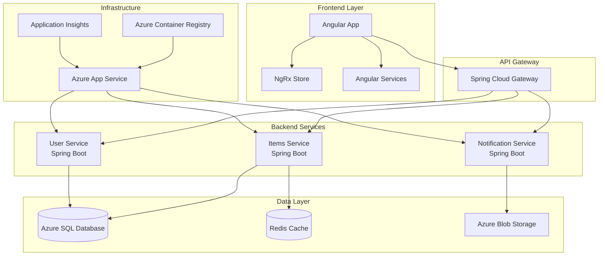

# 🚀 Full-Stack POC: Modern Software Architecture

<div align="center">

[](https://github.com/jin-tech/poc-full-stack/actions)
[](https://github.com/jin-tech/poc-full-stack/security/code-scanning)
[](https://opensource.org/licenses/MIT)
[](https://www.oracle.com/java/)
[](https://spring.io/projects/spring-boot)
[](https://angular.io/)
[](https://azure.microsoft.com/)
[](https://www.terraform.io/)

**A comprehensive proof-of-concept demonstrating enterprise-grade software architecture patterns**

[🎯 Features](#-features) •
[🏗️ Architecture](#️-architecture) •
[🚀 Quick Start](#-quick-start) •
[📚 Documentation](#-documentation) •
[🤝 Contributing](#-contributing)

</div>

## � Table of Contents

- [✨ Features](#-features)
- [🏗️ Architecture](#️-architecture)
- [🛠️ Tech Stack](#️-tech-stack)
- [🚀 Quick Start](#-quick-start)
  - [📋 Prerequisites](#-prerequisites)
  - [⚡ Fast Setup](#-fast-setup)
  - [🔧 Manual Setup](#-manual-setup)
- [🔨 Development](#-development)
  - [🏃‍♂️ Running Services](#️-running-services)
  - [🧪 Testing](#-testing)
  - [🐛 Debugging](#-debugging)
- [🚢 Deployment](#-deployment)
  - [🐳 Docker](#-docker)
  - [☁️ Azure Cloud](#️-azure-cloud)
- [📊 Monitoring & Observability](#-monitoring--observability)
- [🔒 Security](#-security)
- [📚 API Documentation](#-api-documentation)
- [🤝 Contributing](#-contributing)
- [� License](#-license)
- [� Support](#-support)

## ✨ Features

<table>
<tr>
<td>

**🏗️ Architecture**
- Clean Architecture principles
- SOLID design patterns
- Microservices-ready structure
- Event-driven communication

</td>
<td>

**🔒 Security**
- JWT authentication
- Role-based access control
- Input validation & sanitization
- Security headers & CORS

</td>
</tr>
<tr>
<td>

**🧪 Testing**
- Unit tests (95%+ coverage)
- Integration tests
- E2E tests with Playwright
- Contract testing

</td>
<td>

**📊 Observability**
- Structured logging
- Metrics & monitoring
- Health checks
- Distributed tracing

</td>
</tr>
<tr>
<td>

**☁️ Cloud-Native**
- Infrastructure as Code
- Container orchestration
- Auto-scaling capabilities
- CI/CD pipelines

</td>
<td>

**📱 Modern Frontend**
- Angular v20 with standalone components
- Signal-based state management
- Tailwind CSS styling
- Responsive design
- E2E testing with Playwright

</td>
</tr>
</table>

## 🏗️ Architecture



## 🛠️ Tech Stack

### Backend
- **Framework**: Spring Boot 3.x with Java 17+
- **Security**: Spring Security 6 + JWT
- **Data Access**: Spring Data JPA + Hibernate
- **Database**: Azure SQL Database (prod) / H2 (dev)
- **Cache**: Redis
- **Testing**: JUnit 5, Testcontainers, WireMock
- **Documentation**: OpenAPI 3.0 (Swagger)

### Frontend
- **Framework**: Angular 17+ with TypeScript
- **State Management**: NgRx
- **UI Library**: Angular Material + Tailwind CSS
- **Testing**: Jest, Cypress, Playwright
- **Build**: Webpack 5, Vite (dev server)

### Infrastructure & DevOps
- **Cloud Platform**: Microsoft Azure
- **IaC**: Terraform
- **Containerization**: Docker + Docker Compose
- **CI/CD**: GitHub Actions
- **Monitoring**: Application Insights, Prometheus
- **API Gateway**: Azure API Management

## 🚀 Quick Start

### 📋 Prerequisites

| Tool | Version | Purpose |
|------|---------|---------|
| [Java JDK](https://adoptium.net/) | 17+ | Backend runtime |
| [Node.js](https://nodejs.org/) | 18+ | Frontend tooling |
| [Docker](https://www.docker.com/) | 20+ | Containerization |
| [Terraform](https://www.terraform.io/) | 1.0+ | Infrastructure |
| [Azure CLI](https://docs.microsoft.com/en-us/cli/azure/) | 2.0+ | Cloud deployment |

### ⚡ Fast Setup

```bash
# 1. Clone and enter directory
git clone https://github.com/jin-tech/poc-full-stack.git
cd poc-full-stack

# 2. Start everything with Docker
docker-compose up -d

# 3. Access applications
echo "🎉 Setup complete!"
echo "📱 Frontend: http://localhost:4200"
echo "🔧 Backend API: http://localhost:8080"
echo "🏥 Health Check: http://localhost:8080/actuator/health"
echo "📊 MSSQL Database: localhost:1433 (sa/YourStrong@Passw0rd)"
```

### 🔧 Manual Setup

<details>
<summary>Click to expand detailed setup instructions</summary>

#### Backend Setup
```bash
cd backend

# Install dependencies
mvn clean install

# Set up dev database configuration (optional)
cp src/main/resources/application.properties.example src/main/resources/application-dev.properties

# Run the application
./mvnw spring-boot:run
```

#### Frontend Setup
```bash
cd frontend

# Install dependencies
npm install

# Start development server
npm start
```

#### Infrastructure Setup
```bash
cd infrastructure

# Login to Azure
az login

# Initialize Terraform
terraform init

# Plan deployment
terraform plan

# Apply infrastructure
terraform apply
```

</details>

## 🔨 Development

### 🏃‍♂️ Running Services

| Service | Command | URL | Description |
|---------|---------|-----|-------------|
| **Backend** | `./mvnw spring-boot:run` | http://localhost:8080 | REST API server |
| **Frontend** | `npm start` | http://localhost:4200 | Angular development server |
| **Database** | *Auto-starts with backend* | http://localhost:8080/h2-console | H2 web console |
| **All Services** | `docker-compose up` | Various ports | Complete stack |

### 🔧 Environment Profiles

| Profile | Database | Use Case | Security | Description |
|---------|----------|----------|----------|-------------|
| **dev** | MSSQL (Docker localhost:1433) | Local development | Disabled | Default profile for local development |
| **local** | MSSQL (Docker localhost:1433) | Local development | Disabled | Alternative local development profile |
| **docker** | MSSQL (Docker container) | Docker Compose | Disabled | Full stack Docker deployment |
| **test** | H2 (SQL Server mode) | Testing | Disabled | Fast automated testing environment |
| **h2** | H2 (in-memory) | Backup option | Disabled | Pure in-memory development |
| **azure** | Azure SQL Database | Production | Enabled | Production deployment on Azure |

**Default Profile**: `dev` (configured in `application.properties`)
**Database Requirement**: MSSQL Server running on `localhost:1433` for most profiles

### 🧪 Testing

```bash
# Backend tests
cd backend
./mvnw test                    # Unit tests
./mvnw integration-test        # Integration tests
./mvnw verify                  # All tests + quality checks

# Frontend tests
cd frontend
npm test                       # Unit tests (Jest)
npm run test:watch            # Watch mode
npm run e2e                   # E2E tests (Cypress)
npm run test:coverage         # Coverage report
```

### 🐛 Debugging

<details>
<summary>Debug configurations and troubleshooting</summary>

#### Backend Debugging
- **IDE**: Use Spring Boot debug configuration
- **Port**: 5005 (debug port)
- **Profile**: Set `spring.profiles.active=dev`

#### Frontend Debugging
- **Chrome DevTools**: Built-in Angular debugging
- **VS Code**: Angular debugging extension
- **Redux DevTools**: For NgRx state inspection

#### Common Issues
- **Port conflicts**: Change ports in `application.properties`
- **CORS issues**: Verify `@CrossOrigin` annotations
- **Database connection**: Check H2 console at `/h2-console`

</details>

## 🚢 Deployment

### 🐳 Docker

```bash
# Build images
docker-compose build

# Production deployment
docker-compose -f docker-compose.prod.yml up -d

# Scale services
docker-compose up --scale backend=3
```

### ☁️ Azure Cloud

```bash
# Deploy infrastructure
cd infrastructure
terraform apply

# Deploy applications
az webapp deployment source config-zip \
  --resource-group poc-rg \
  --name poc-backend \
  --src backend.zip
```

## 📊 Monitoring & Observability

| Tool | Purpose | URL |
|------|---------|-----|
| **Application Insights** | APM & monitoring | Azure Portal |
| **Health Checks** | Service health | `/actuator/health` |
| **Metrics** | Performance metrics | `/actuator/metrics` |
| **Logs** | Application logs | `/logs` or Azure Portal |

## 🔒 Security

- ✅ **Authentication**: JWT-based with refresh tokens
- ✅ **Authorization**: Role-based access control (RBAC)
- ✅ **Input Validation**: Bean validation + custom validators
- ✅ **SQL Injection**: Protected via JPA/Hibernate
- ✅ **XSS Protection**: Angular's built-in sanitization
- ✅ **CSRF Protection**: Enabled for state-changing operations
- ✅ **HTTPS**: Enforced in production
- ✅ **Security Headers**: Configured via Spring Security

## 📚 API Documentation

### Backend API (Swagger UI)
- **Swagger UI**: http://localhost:8080/swagger-ui.html
- **OpenAPI JSON**: http://localhost:8080/api-docs

### Frontend Documentation
- **Modernization Summary**: `frontend/MODERNIZATION_SUMMARY.md`
- **Best Practices Guide**: `frontend/best-practices.md`

The Swagger UI provides:
- Interactive API testing
- Request/response examples
- Authentication documentation
- Comprehensive endpoint documentation

## 🤝 Contributing

We welcome contributions! Please see our [Contributing Guide](CONTRIBUTING.md) for details.

<details>
<summary>Quick contribution steps</summary>

1. Fork the repository
2. Create your feature branch (`git checkout -b feature/amazing-feature`)
3. Commit your changes (`git commit -m 'Add amazing feature'`)
4. Push to the branch (`git push origin feature/amazing-feature`)
5. Open a Pull Request

**Development Guidelines:**
- Follow [Conventional Commits](https://conventionalcommits.org/)
- Ensure tests pass (`npm test` & `./mvnw test`)
- Update documentation as needed
- Add tests for new features

</details>

## � License

This project is licensed under the MIT License - see the [LICENSE](LICENSE) file for details.

## � Support

<div align="center">

**Need help? We've got you covered!**

[](https://github.com/jin-tech/poc-full-stack/issues)
[](https://github.com/jin-tech/poc-full-stack/discussions)

[📝 Create Issue](https://github.com/jin-tech/poc-full-stack/issues/new) •
[💬 Start Discussion](https://github.com/jin-tech/poc-full-stack/discussions/new) •
[📧 Email Support](mailto:support@yourproject.com)

</div>

---

<div align="center">

**⭐ Star this repo if it helped you!**

Made with ❤️ by [jin-tech](https://github.com/jin-tech)

</div>